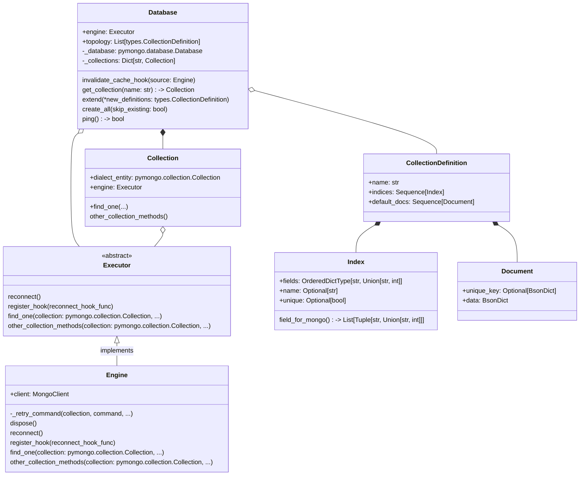

# Mongomancy

## Description

Project contains abstraction of `pymongo` driver for automatic reconnect on master switch in remote MongoDB cluster. It
also provides data definition layer.

Core of `mongo_driver` is the `Engine` class, handling queries reconnection with notification to registered reconnect
hooks.
`Database` creates `Collection`s by their definitions. Database hooks itself to engine reconnect event, so it can switch
internal state of database's collections instances.



## Installation

Within a particular ecosystem, there may be a common way of installing things, such as using Yarn, NuGet, or Homebrew.
However, consider the possibility that whoever is reading your README is a novice and would like more guidance. Listing
specific steps helps remove ambiguity and gets people to using your project as quickly as possible. If it only runs in a
specific context like a particular programming language version or operating system or has dependencies that have to be
installed manually, also add a Requirements subsection.

## Usage

```python
import logging
from mongomancy import Engine, Database, CollectionDefinition, Index

engine = Engine("localhost", 27017)
logger = logging.getLogger(__name__)
db = Database(engine=engine, logger=logger)
game = CollectionDefinition(name="game", indices=[Index(fields={"genre": 1})])
player = CollectionDefinition(name="player", indices=[Index(fields={"player_id": 1}, unique=True)])
db.add_collection(game)
db.add_collection(player)
db.create_all()
db["game"].find({"genre": "adventure"})
```

## Tests

You can run tests with coverage tracing:

```shell
python -m coverage run -m unittest tests/test_* -v 
```

To generate coverage report:

```shell
python -m coverage html   
```

## Build

Clone repo and set up your pypi repo account credentials on build for build environment.

- Move to package repo:

    ```shell
    cd ~/git/mongomancy
    ```

- Install requirements:

   ```shell
   python -m pip install -Ur requirements.txt
   ```

- Clean old build fragments:

    ```shell
    rm -rf ./dist ./build ./mongomancy/mongomancy.egg-info
    ```

- Build new package:

    ```shell
    python -m build
    ``` 

- Upload new package:

    ```shell
    python -m twine upload dist/* 
    ```